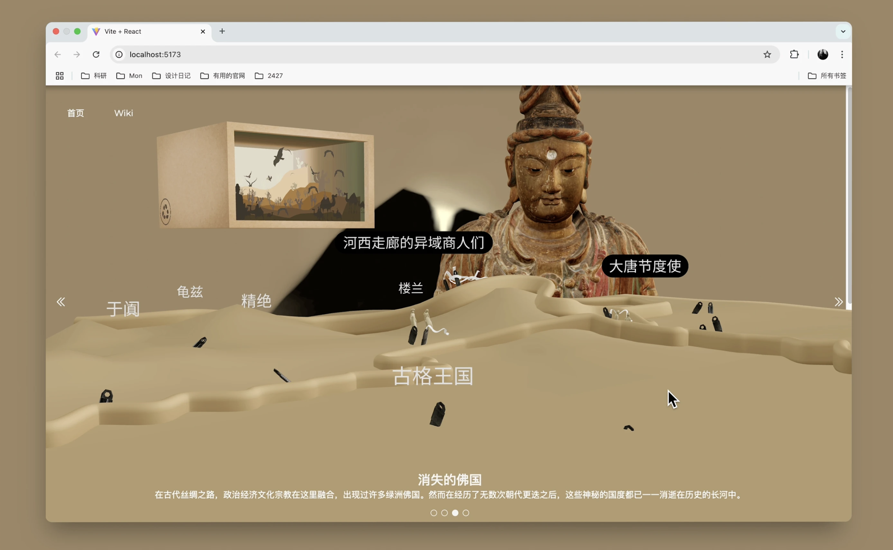

# 丝路档案馆 (Silk Road Archive) - 3D 交互体验项目

这是一个基于 **React**、**Three.js (React Three Fiber)** 和 **Tailwind CSS** 构建的沉浸式 3D 交互网页项目。它通过精美的 3D 模型、流畅的相机运镜和交互式 UI，展现了丝绸之路的文化底蕴、佛教七宝以及消失的绿洲佛国。



[点击查看：丝路档案馆 (Silk Road Archive) - Behance 项目展示](https://www.behance.net/gallery/215776145/3DSilk-Road-3D-Website)

## 🌟 项目亮点

- **沉浸式 3D 场景**：使用 `@react-three/fiber` 和 `@react-three/drei` 渲染高品质 3D 模型。
- **动态相机运镜**：根据不同的页面章节（Intro, Titanium, Camera, Action-button）自动平滑切换视角。
- **交互式 UI**：结合 Tailwind CSS 构建的响应式 UI 界面，支持与 3D 空间的实时交互（如悬停高亮 3D 模型）。
- **滚动控制 (ScrollControls)**：在特定章节使用滚动驱动相机移动和动画播放。

## 🛠️ 技术栈

- **前端框架**：React
- **3D 引擎**：Three.js / React Three Fiber (R3F)
- **组件库**：@react-three/drei (提供相机控制、模型加载、Html 标签等)
- **样式**：Tailwind CSS
- **动画库**：Maath (用于平滑的数值衰减动画)
- **调试工具**：Leva (已在生产模式中隐藏)

## 🚀 快速开始

### 1. 克隆仓库

```bash
git clone <你的仓库地址>
cd <项目文件夹名称>
```

### 2. 安装依赖

使用 npm:

```bash
npm install --registry=[https://registry.npmmirror.com](https://registry.npmmirror.com)
```

或使用 yarn:

```bash
yarn install --registry=[https://registry.npmmirror.com](https://registry.npmmirror.com)
```

### 3. 本地运行

```bash
npm run dev
# 或者
yarn dev
```

启动后，在浏览器访问 http://localhost:5173 (具体取决于你的 Vite 配置) 即可查看项目。

## 📂 项目结构 (src 目录)

- **main.jsx** & **App.jsx**: 项目入口文件，负责初始化 React 应用、配置 `Canvas` 渲染场景以及管理全局状态（如当前展示章节）。
- **index.css**: 全局样式表，集成了 Tailwind CSS 指令，并包含自定义的字体配置、全屏布局样式以及 UI 元素的过渡动画。
- **components/Experience.jsx**: 核心 3D 逻辑组件。负责处理相机的四种运镜模式、3D 模型（如莲花、七宝、观音像）的加载与预加载、光照环境设置以及不同章节的场景切换。
- **components/UI.jsx**: 2D UI 界面组件。包含 `BackgroundUI`（背景文字）和 `UI`（交互按钮及内容），负责章节切换导航、文字展示以及与 3D 场景的 hover 交互逻辑。
- **assets/**: 存放静态资源文件（如 SVG 图标等）。

## ⚠️ 注意事项

1. **静态资源**：本项目高度依赖外部资源。请确保 `.glb` 3D 模型文件存放于 `/public/models/` 目录下，图片资源存放于 `/public/img/` 目录下，否则 3D 场景将因找不到资源而无法正常渲染。
2. **浏览器兼容性**：由于使用了复杂的 WebGL 渲染，请务必使用支持 **WebGL 2.0** 的现代浏览器（如 Chrome, Edge, Firefox, Safari 等）以获得最佳性能和视觉效果。
3. **交互说明**：在特定章节（如第三页）中，系统会根据滚动条的偏移量自动调整相机机位，请使用鼠标滚轮或滚动条进行探索。

## 📄 许可

本项目采用 [MIT License] 开源协议。
